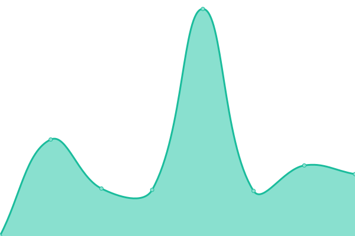
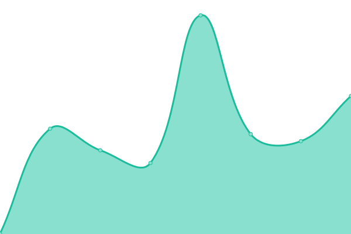

# [📈 Live Status](https://upptime.github.io/upptime): <!--live status--> **🟩 All systems operational**

This repository contains the open-source uptime monitor and status page for [Upptime](https://upptime.js.org), powered by [Upptime](https://github.com/upptime/upptime).

With [Upptime](https://upptime.js.org), you can get your own unlimited and free uptime monitor and status page, powered entirely by a GitHub repository. We use [Issues](https://github.com/upptime/upptime/issues) as incident reports, [Actions](https://github.com/WhitecapRSC/whitecaprsc-upptime/actions) as uptime monitors, and [Pages](https://upptime.github.io/upptime) for the status page.

<!--start: status pages-->
<!-- This summary is generated by Upptime (https://github.com/upptime/upptime) -->
<!-- Do not edit this manually, your changes will be overwritten -->
<!-- prettier-ignore -->
| URL | Status | History | Response Time | Uptime |
| --- | ------ | ------- | ------------- | ------ |
|  [Google Mail](https://mail.google.com/mail) | 🟩 Up | [google-mail.yml](https://github.com/WhitecapRSC/whitecaprsc-upptime/commits/HEAD/history/google-mail.yml) | 

 310ms
     
 | 

<a href="https://WhitecapRSC.github.io/whitecaprsc-upptime/history/google-mail">100.00%</a>
    

|  [Google Meet](https://meet.google.com) | 🟩 Up | [google-meet.yml](https://github.com/WhitecapRSC/whitecaprsc-upptime/commits/HEAD/history/google-meet.yml) | 

 237ms
     
 | 

<a href="https://WhitecapRSC.github.io/whitecaprsc-upptime/history/google-meet">100.00%</a>
    

|  [Google Chat](https://mail.google.com/chat/) | 🟩 Up | [google-chat.yml](https://github.com/WhitecapRSC/whitecaprsc-upptime/commits/HEAD/history/google-chat.yml) | 

 330ms
     
 | 

<a href="https://WhitecapRSC.github.io/whitecaprsc-upptime/history/google-chat">100.00%</a>
    

|  [Google Workspace Status](https://www.google.com/appsstatus/dashboard/) | 🟩 Up | [google-workspace-status.yml](https://github.com/WhitecapRSC/whitecaprsc-upptime/commits/HEAD/history/google-workspace-status.yml) | 

 50ms
     
 | 

<a href="https://WhitecapRSC.github.io/whitecaprsc-upptime/history/google-workspace-status">100.00%</a>
    

|  [Notion](https://notion.so) | 🟩 Up | [notion.yml](https://github.com/WhitecapRSC/whitecaprsc-upptime/commits/HEAD/history/notion.yml) | 

 294ms
     
 | 

<a href="https://WhitecapRSC.github.io/whitecaprsc-upptime/history/notion">100.00%</a>
    

|  [Notion Status](https://status.notion.so/) | 🟩 Up | [notion-status.yml](https://github.com/WhitecapRSC/whitecaprsc-upptime/commits/HEAD/history/notion-status.yml) | 

 463ms
     
 | 

<a href="https://WhitecapRSC.github.io/whitecaprsc-upptime/history/notion-status">100.00%</a>
    

|  [Acuity Status](https://status.acuityscheduling.com/) | 🟩 Up | [acuity-status.yml](https://github.com/WhitecapRSC/whitecaprsc-upptime/commits/HEAD/history/acuity-status.yml) | 

 473ms
     
 | 

<a href="https://WhitecapRSC.github.io/whitecaprsc-upptime/history/acuity-status">100.00%</a>
    

|  [Squarespace Status](https://status.squarespace.com/) | 🟩 Up | [squarespace-status.yml](https://github.com/WhitecapRSC/whitecaprsc-upptime/commits/HEAD/history/squarespace-status.yml) | 

 432ms
     
 | 

<a href="https://WhitecapRSC.github.io/whitecaprsc-upptime/history/squarespace-status">100.00%</a>
    

|  [TellaHealth](https://tellahealth.ca) | 🟩 Up | [tella-health.yml](https://github.com/WhitecapRSC/whitecaprsc-upptime/commits/HEAD/history/tella-health.yml) | 

 1148ms
     
 | 

<a href="https://WhitecapRSC.github.io/whitecaprsc-upptime/history/tella-health">99.79%</a>
    

|  [Sling](https://getsling.com) | 🟩 Up | [sling.yml](https://github.com/WhitecapRSC/whitecaprsc-upptime/commits/HEAD/history/sling.yml) | 

 149ms
     
 | 

<a href="https://WhitecapRSC.github.io/whitecaprsc-upptime/history/sling">100.00%</a>
    

<!--end: status pages-->

[**Visit our status website →**](https://upptime.github.io/upptime)

## 📄 License

- Powered by: [Upptime](https://github.com/upptime/upptime)
- Code: [MIT](./LICENSE) © [Upptime](https://upptime.js.org)
- Data in the `./history` directory: [Open Database License](https://opendatacommons.org/licenses/odbl/1-0/)
